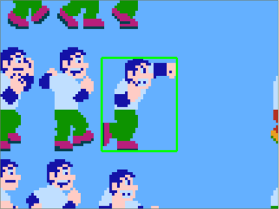
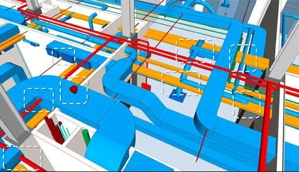
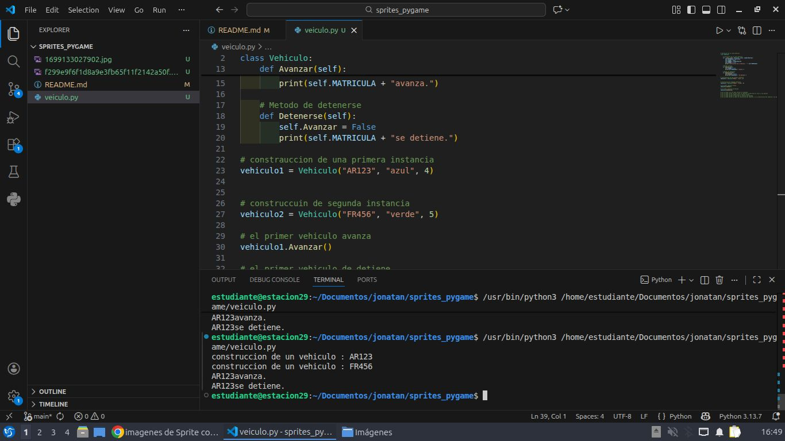
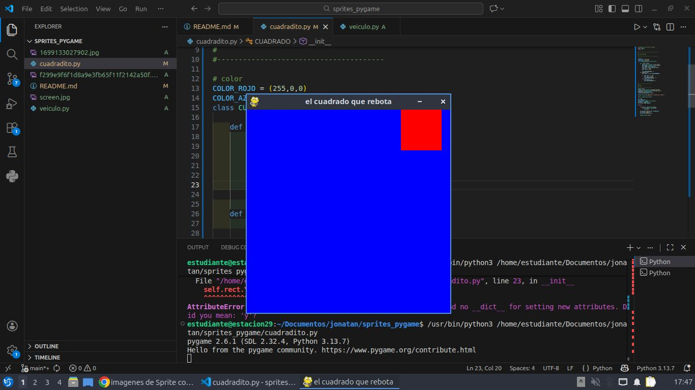

# sprites_pygame

# ¿que es Sprites con Pygame?

La noción de sprite es fundamental en el desarrollo de videojuegos y, en particular, en el
desarrollo de Pygame. Cuando abordamos el desarrollo de un videojuego, nos damos cuenta
de que sistemáticamente encontramos el siguiente patrón recurrente: asociar una ubicación de
la ventana con una representación gráfica y un conjunto de propiedades. Esto es cierto
siempre: para elementos del escenario, las paredes de un laberinto, los personajes, el héroe o
la heroína, los enemigos y, en general, para cualquier elemento gráfico del juego. Obviamente
esto es cierto para los objetos que se manipulan durante el escenario del juego. Por ejemplo,
armas, objetos utilizados por los personajes o el balón de un juego deportivo.

Por lo tanto, podemos pensar en un sprite como un objeto que asocia una ubicación, una
representación gráfica (esta o aquella imagen, por ejemplo) y un conjunto de propiedades.
Estas propiedades pueden ser un nombre, un texto, valores booleanos que caracterizan el
objeto en cuestión (por ejemplo, si el objeto se puede mover o no).

Una posible traducción del término "sprite" podría ser "imagen-objeto" (en el sentido de
programación orientada a objetos), que se actualiza con cada iteración del bucle del juego.
Pero cuanto más complejo es el juego, más objetos gráficos tiene que gestionar y actualizar, lo
que puede ser tedioso. Por esta razón Pygame formaliza no sólo la noción de sprite, sino
también la noción de grupo de sprites

## La noción de grupo en Pygame

Por un lado, la manipulación de sprites permite no "reinventar la rueda" con cada programa
nuevo, sino ser más eficiente en el desarrollo gracias a otra noción: la de grupo. Un grupo es
una colección de sprites. Por lo tanto, un determinado procesamiento se puede aplicar a un
conjunto o subconjunto de sprites: por ejemplo, cambiar el color de todos los enemigos o hacer
invisibles objetos decorativos de un tipo determinado. Las posibilidades son infinitas. Sobre
todo, en una línea en el bucle del juego, puede actualizar una gran cantidad de sprites a la vez.

## Gestión simplificada de colisiones

1. El paradigma del objeto, las líneas principales
La primera idea de la programación orienta a objetos es manipular objetos que representan un
concepto de la realidad o no. Por ejemplo, podemos intentar representar un vehículo y
considerar que está compuesto por una matrícula, un color de carrocería y un número de
puertas (tres o cinco puertas). También queremos saber si el vehículo funciona o no.

El concepto unificador que agrupa propiedades (matrícula, color, etc.) y posibles acciones
(avanzar, detenerse) es el de clase. Aquí estamos definiendo el Vehiculo.

Las propiedades que caracterizan la clase Vehiculo (matrícula, color, etc.) se denominan
atributos.

Una acción de la clase Vehiculo como detenerse o avanzar, es un método. Un método no es ni
más ni menos que una función definida dentro de una clase.

Por lo tanto, una clase es un concepto unificador que agrupa una colección de atributos y
métodos.

Ahora es necesario crear automóviles a partir de este modelo que constituye esta clase
Vehiculo. Por ejemplo, tendremos los siguientes vehículos:

Matrícula: AR123; color: rojo; número de puertas: 3; posibilidad de hacer avanzar y detener el
vehículo.

Matrícula: FR456; color: verde; número de puertas: 5; posibilidad de hacer avanzar y detener el
vehículo.

Estos dos vehículos diseñados según el modelo de la clase Vehiculo, son instancias de la clase
Vehiculo.

## La herencia
En programación orientada a objetos, la herencia consiste en heredar una clase B de una clase
A. Es decir, la clase B se beneficia de las propiedades y métodos de la clase A.

Una instancia de personaje tiene un nombre, un tipo (de personaje) y la capacidad de cantar.
Por lo tanto, una instancia Druida que hereda de la clase personaje tiene un nombre (heredado
de Personaje), un tipo (heredado de Personaje) que se establece en valor

Definimos la clase padre, la Clase Personaje

En Python, indicamos con esta sencilla sintaxis que la clase B hereda de la clase A: B(A)
Así que creamos la clase Druida que hereda de Personaje.

Posteriormente, probamos estas dos clases creando una druida llamada Pygamix.

Cuando ejecutamos el programa anterior, se obtiene lo siguiente en la terminal:
El personaje llamado Pygamix canta.
El druida llamado Pygamix inventa una poción.

# Palabras clave fundamentales en Python

## La palabra clave self
Hay una palabra clave fundamental en Python cuando se manipula el paradigma de objeto. Se
trata de la palabra clave self.
Esta palabra clave es el equivalente de this en C++ o C#. Representa la instancia actual. Por
lo tanto, en una porción dada del código, podemos especificar que accedemos a un atributo de
la instancia actual o que llamamos a un método de la instancia actual.

## La palabra clave class
La palabra clave class es, como era de esperar, la palabra clave que define una clase en
Python.

## La palabra clave def
La palabra clave def se utiliza para definir una función nueva. También permite definir un
método nuevo dentro de una clase.

__init__ en realidad no es una palabra clave, pero no importa. Se corresponde con la
nomenclatura (obligatoria) del inicializador de la clase. Lo que es necesario recordar es que
hace posible crear e inicializar una instancia de clase.

## ejemplo de clase vehiculo

# ejemplo del cuadrado
